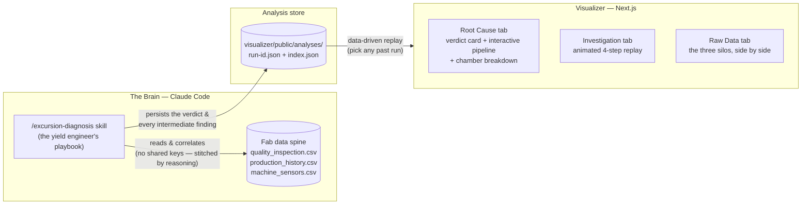

<div align="center">


# Foundry Brain

**An AI yield engineer for semiconductor fabs — Company Brain, built for the fab.**

*When yield suddenly drops, Foundry Brain walks the fab's three disconnected data systems, names the root-cause machine with evidence, recommends hold-or-ship, and replays its entire investigation in a live UI.*

Built at the [Compiled Global AI Hackathon](https://luma.com/compiled-4qzo?tk=wryZrQ) (YC RFS "Company Brain" theme).

</div>

---

## 60-second tour for reviewers

```bash
# 1. Run the visualizer (the investigation is pre-loaded — no setup beyond npm)
cd visualizer && npm install && npm run dev
# → open http://localhost:3000

# 2. (Optional, the real magic) Run the AI yield engineer itself with Claude Code
claude   # from the repo root
> /excursion-diagnosis        # or just say "yield dropped, why?"
```

The UI opens **already concluded**: the root cause (`Etch-3 / Chamber C`, 97% confidence), the fab pipeline with the culprit stage highlighted, and a per-chamber breakdown showing exactly *which* chamber failed *which* lots. Press **Replay again** to watch the AI's 4-step investigation animate end-to-end (~17 seconds).

---

## The problem

Semiconductor fabs lose **$300–600B/year** to yield loss. When the good-chip rate suddenly drops (an *excursion*), someone must answer two questions fast:

1. **Which machine caused it?**
2. **Should the lots in flight be held or shipped?**

Today that someone is a human **yield engineer** ($100k–140k/yr, scarce, and their know-how walks out the door when they leave). The job is hard because the evidence is scattered across **three systems that don't share a key**:

| System | What it records | Keyed by |
|---|---|---|
| Quality Inspection (metrology) | film thickness & pass/fail per lot | `lot_id + wafer` |
| Production History (MES) | which lot ran on which tool/chamber, when | `lot_id` |
| Machine Sensors (FDC) | tool telemetry over time | `equipment + chamber + timestamp` — **no lot id at all** |

Worse: the root cause is typically an **in-spec drift** — a parameter that wanders out of the process band but stays *under the alarm limit*, so no automated monitor ever fires. Joining these systems requires judgment, not a static JOIN — recipes change, lots split and merge, and the mapping is different every time.

## The thesis

**The expertise is a procedure, not a model.** A senior yield engineer's investigation is a repeatable playbook: *inspection → routing commonality → sensor telemetry → correlation → disposition.* Foundry Brain encodes that playbook as a **Claude Code skill**. The LLM reads live data and reasons step by step — no training on confidential fab data (which fabs would never share anyway), and every step of the reasoning is **auditable**.

---

## Architecture



Two decoupled halves, connected by a JSON contract:

1. **The skill** (`.claude/skills/excursion-diagnosis/`) does the actual investigation on raw CSVs and **writes the complete analysis record** — every table it queried, the failing lots, the routing graph, the RF telemetry series, the verdict — to `visualizer/public/analyses/`.
2. **The visualizer** (`visualizer/`) is a pure replay engine. It renders *any* saved analysis: the UI is 100% data-driven, so each new investigation the skill runs shows up in the **Replay analysis** dropdown with zero UI changes.

This mirrors how the product would work in a real fab: the agent investigates continuously in the background; humans open a dashboard where **the conclusion is already waiting**, and replay the reasoning only when they want to audit it.

---

## How an investigation works

The skill (`/excursion-diagnosis`) follows the playbook a senior engineer would — one system at a time, narrating every step:

| Step | System | What it does | Finding (seed scenario) |
|---|---|---|---|
| 1 | Quality Inspection | Find lots below the 46.7 nm thickness floor | 5 of 11 lots FAIL |
| 2 | Production History | Group failing lots' routes by `step, equipment, chamber`; find what they share that passing lots don't | CVD & CMP: no pattern. **All 5 share Etch-3 / Chamber C, 10:00–12:00** |
| 3 | Machine Sensors | Pull RF power for that chamber over that window | Drift to **2.31 kW** (center 2.10) — under the 2.40 kW alarm, so **no alert ever fired** |
| 4 | Correlation | One chamber = 100% of failures; drift co-occurs with thickness loss | **ROOT CAUSE: Etch-3 / C** → recommend **HOLD** affected lots |

It then prints a compact verdict card, saves the run as a JSON record, and launches the visualizer so the operator can watch the same four steps replay.

> The data is synthetic (real fab data is a trade secret), but the *structure* of the problem is faithful: three disconnected key schemas, and a root cause hiding as a sub-alarm drift.

---

## The visualizer

| | |
|---|---|
| **Opens concluded** | No button-pressing to get value: the verdict card (root cause, confidence, affected lots, `$` exposure, *Generate isolation order*) is the first thing on screen. |
| **Interactive fab pipeline** | Wafer lot → CVD → Etch → CMP → Inspection. An intro pulse flows down the line, then locks on the culprit stage. **Click any stage** to drill into its chamber breakdown. |
| **"Which chamber did it"** | The drill-down lists every chamber that ran lots that shift — the root-cause chamber is locked in red with its failing-lot IDs (`5/5 failed`); clean chambers show a green *clear*. |
| **Animated investigation replay** | *Replay again* walks the 4 steps live: the source rail lights up per system, queries render in a terminal card, tables scan & highlight hits, wafer maps / routing graph / RF chart draw themselves. |
| **Replay any past run** | Header dropdown lists every stored analysis; the whole UI re-renders from that record. |
| **Honest raw data** | The Raw Data tab shows the three silos side by side — so reviewers can verify the reasoning wasn't given the answer. |
| **Focused chrome** | Collapsible sidebar (slim rail mode) and a collapsible *Investigation log* keep the verdict front and center. Hand-drawn SVG icon system throughout (no emoji). |

---

## Built with G-Stack & G-Brain

This project was **built by an AI agent, for an AI agent** — the development workflow itself ran on [gstack](.claude/skills/gstack/), a suite of Claude Code skills vendored in this repo (`.claude/skills/`):

- **`/qa`, `/design-review`** — the agent drove a persistent headless browser (gstack's Chromium daemon) to test the UI it had just written and fix visual issues it found.
- **`/plan-ceo-review`, `/plan-eng-review`** — plans were reviewed in founder-mode / eng-manager-mode before implementation.
- **`/ship`** — merge-base, tests, diff review, changelog, PR — as one command.
- **G-Brain** (`/setup-gbrain`, `/sync-gbrain`) — a persistent knowledge base for the agent: semantic code search over this repo plus cross-session memory (decisions, retros, learnings). This is the same "brain accumulates memory" primitive the product roadmap builds on — Foundry Brain's future skills query past excursions the way gbrain queries past sessions.

The layering is the demo: **gstack/gbrain are the "Company Brain" substrate; Foundry Brain is that substrate specialized for the fab.**

---

## Getting started

**Prerequisites:** Node.js 20+, npm, and (for the AI investigation) [Claude Code](https://claude.com/claude-code).

### Run the UI

```bash
cd visualizer
npm install
npm run dev
# → http://localhost:3000  (auto-falls back to :3001 if 3000 is busy)
```

### Run the AI yield engineer

```bash
claude            # start Claude Code at the repo root
```

Then either invoke the skill directly:

```
/excursion-diagnosis
```

…or just describe the problem in natural language — the skill triggers on phrases like *"yield dropped"*, *"diagnose the excursion"*, *"which machine caused the defects"* (Japanese works too: *「歩留まりが落ちた」*). The agent will:

1. investigate the three CSVs step by step (watch it narrate),
2. print the verdict card,
3. save the run to `visualizer/public/analyses/`,
4. launch the visualizer and point you at the replay.

---

## Repository structure

```
foundry-brain/
├── .claude/skills/
│   ├── excursion-diagnosis/       # ★ the AI yield engineer (Foundry Brain skill #1)
│   │   ├── SKILL.md               #   the investigation playbook
│   │   └── data/                  #   the fab's three systems (CSV)
│   │       ├── quality_inspection.csv
│   │       ├── production_history.csv
│   │       └── machine_sensors.csv
│   └── gstack/                    # dev-workflow skill suite (qa, ship, gbrain, …)
├── visualizer/                    # ★ Next.js replay UI
│   ├── public/analyses/           #   saved analysis records (the skill writes here)
│   │   ├── index.json             #   run history for the header dropdown
│   │   └── 2026-07-04-etch3c.json #   seed scenario
│   └── src/
│       ├── app/page.tsx           #   tabs, sidebar, replay engine
│       ├── lib/analysis.ts        #   the Analysis JSON contract (skill ↔ UI)
│       └── components/            #   PipelineOverview, FabFloor, WaferMap,
│                                  #   RfChart, VerdictCard, DataTable, icons
├── skeleton.md                    # pitch narrative & market sizing (Japanese)
└── slides.html                    # pitch deck
```

**Tech stack:** Next.js 16 (Turbopack) · React 19 · Tailwind CSS 4 · Framer Motion · Claude Code skills · gstack/gbrain.

---

## Why this can be a company

- **Cost pool:** yield-related loss is 5–10% of a ~$600B industry. One excursion costs $1–10M; a fab eats 5–15 per year. Cutting decision latency from hours to minutes is worth **$1–10M per fab per year**.
- **Why now:** fabs could never share data to train a model — but a *procedural* agent needs no training data, only the playbook. That playbook is exactly what retires with senior engineers today.
- **Wedge:** greenfield fabs (e.g. Rapidus, 2nm, 2027) with zero tool lock-in and zero accumulated tribal knowledge.
- **Roadmap:** this repo ships skill #1. Sibling skills — *Hold-or-Ship disposition*, *Drift Watch*, *Commonality analysis* — run on the same three-system data spine, and the brain's memory of past excursions (the gbrain pattern) compounds with every run.

---

<div align="center">
<sub>Foundry Brain — because the fab's most valuable machine is the one that remembers why the last one broke.</sub>
</div>
