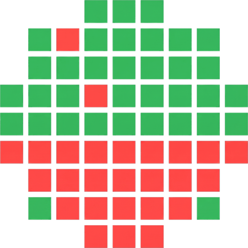
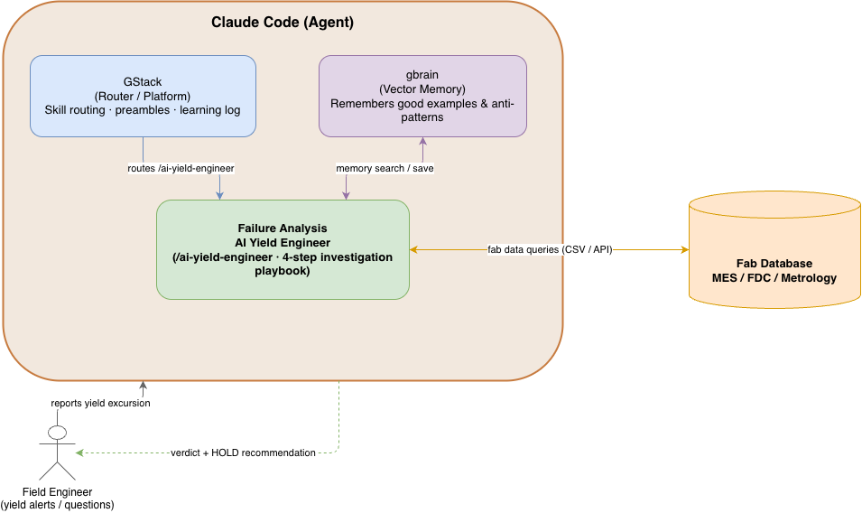

<div align="center">



# Foundry Brain

**An AI yield engineer for semiconductor fabs — Company Brain, built for the fab.**

*When yield suddenly drops, Foundry Brain walks the fab's three disconnected data systems, names the root-cause machine with evidence, recommends hold-or-ship, replays its investigation in a live UI — and remembers every case, getting better with each one.*

Built at the [Compiled Global AI Hackathon](https://luma.com/compiled-4qzo?tk=wryZrQ) (YC RFS "Company Brain" theme).

</div>

---

## 60-second tour for reviewers

```bash
# 1. Run the visualizer (opens already concluded — no button-pressing to get value)
cd visualizer && npm install && npm run seed-analyses && npm run dev
# → open http://localhost:3000

# 2. (The real magic) Run the AI yield engineer itself with Claude Code
claude   # from the repo root
> /ai-yield-engineer          # or just say "yield dropped, why?"
```

The UI opens with the verdict already on screen: root cause **Etch-3 / Chamber C** (97% confidence), the fab pipeline with the culprit stage highlighted, and a per-chamber breakdown showing exactly *which* chamber failed *which* lots. Press **Replay again** to watch the AI's 4-step investigation animate end-to-end (~17 s), then rate the analysis 👍/👎 — the rating feeds the brain's memory.

---

## The problem

Semiconductor fabs lose **$300–600B/year** to yield loss. When the good-chip rate suddenly drops (an *excursion*), someone must answer two questions fast:

1. **Which machine caused it?**
2. **Should the lots in flight be held or shipped?**

Today that someone is a human **yield engineer** ($100k–140k/yr, scarce, and their know-how walks out the door when they leave). The job is hard because the evidence is scattered across **three systems that don't share a key**:

| System | What it records | Keyed by |
|---|---|---|
| Quality Inspection (Metrology) | film thickness & pass/fail per lot | `lot_id + wafer` |
| Production History (MES) | which lot ran on which tool/chamber, when | `lot_id` |
| Machine Sensors (FDC) | tool telemetry over time | `equipment + chamber + timestamp` — **no lot id at all** |

Worse: the root cause is typically an **in-spec drift** — a parameter that wanders out of the process band but stays *under the alarm limit*, so no automated monitor ever fires. Joining these systems takes judgment, not a static JOIN — recipes change, lots split and merge, and the mapping is different every time.

## The thesis

**The expertise is a procedure plus memory, not a trained model.** A senior yield engineer's investigation is a repeatable playbook (*inspection → routing commonality → sensor telemetry → correlation → disposition*) informed by memory of past cases. Foundry Brain encodes the playbook as a **Claude Code skill** and the memory as **gbrain pages** — no training on confidential fab data (which fabs would never share anyway), and every reasoning step is **auditable**.

---

## Architecture



Everything runs inside a **Claude Code agent**, structured on the GStack model — *one brain, many skills*:

| Component | Role |
|---|---|
| **GStack** (router / platform) | Routes requests to the right skill (`/ai-yield-engineer`), runs skill preambles, records usage & learnings. |
| **gbrain** (vector memory) | Persistent memory of past excursions: good examples and anti-patterns, tagged with a `quality` rating. Loaded *before* each investigation, written *after* it. |
| **AI Yield Engineer** (`/ai-yield-engineer`) | The failure-analysis skill — a 4-step investigation playbook that stitches the three fab systems by reasoning. |
| **Fab database** (`foundry-brain/data/`) | The shared data spine: MES / FDC / Metrology as CSVs (CSV/API in production). |
| **Field engineer** (human) | Reports the yield alert or asks a question in chat; receives the verdict + HOLD recommendation, and rates the analysis in the replay UI. |

The **visualizer** (Next.js) is a pure replay engine on top: the skill persists every investigation as a JSON record (`visualizer/public/analyses/`), and the UI re-renders any past run from that record — zero UI changes per new investigation.

→ Full pipeline deep-dive with sequence diagrams: [`docs/ARCHITECTURE.md`](docs/ARCHITECTURE.md)

---

## How an investigation works

`/ai-yield-engineer` follows the playbook a senior engineer would — one system at a time, narrating every step so the reasoning stays auditable:

| Step | System | What it does | Finding (seed scenario) |
|---|---|---|---|
| 0 | **gbrain memory** | Load up to 3 `quality: good` past cases + known anti-patterns before touching data | "in-spec drift hid a past excursion — check sub-alarm bands" |
| 1 | Quality Inspection | Find lots below the 46.7 nm thickness floor | 5 of 11 lots FAIL |
| 2 | Production History | Group failing lots' routes by `step, equipment, chamber`; find what they share that passing lots don't | CVD & CMP: no pattern. **All 5 share Etch-3 / Chamber C, 10:00–12:00** |
| 3 | Machine Sensors | Pull RF power for that chamber over that window | Drift to **2.31 kW** (center 2.10) — under the 2.40 kW alarm, so **no alert ever fired** |
| 4 | Correlation | One chamber = 100% of failures; drift co-occurs with thickness loss | **ROOT CAUSE: Etch-3 / C** → recommend **HOLD** affected lots |

It then prints a compact verdict card, saves the run as a JSON record, launches the visualizer, and **writes the case into gbrain memory** with an automatic self-evaluation.

> The data is synthetic (real fab data is a trade secret), but the *structure* of the problem is faithful: three disconnected key schemas, and a root cause hiding as a sub-alarm drift.

## The memory loop (how the brain improves)

```
investigate → persist analysis JSON → auto-eval → save to gbrain (quality: pending_review)
     ↑                                                        │
     └── next run loads good examples & anti-patterns ←───────┤
                                                              │
   field engineer rates 👍/👎 in the UI → /api/feedback ──────┘
                        (updates the gbrain page's quality tag)
```

- **Before** each run, the skill searches gbrain for `foundry-excursions/` (past analyses) and `foundry-patterns/` (reusable lessons) — memory informs hypotheses, but CSV evidence is still required.
- **After** each run, `foundry-gbrain-save.py` stores the case and `foundry-eval-analysis.py` self-grades it.
- **Human feedback closes the loop:** the 👍/👎 rating on the verdict card posts to `/api/feedback`, which writes `<id>.feedback.json` and calls `foundry-sync-feedback.py` to update the memory page's `quality` tag (`good` / `bad`). Bad analyses become anti-patterns the next investigation explicitly avoids.

This is the Company Brain claim made concrete: **the product compounds** — every excursion it sees makes the next diagnosis faster and sharper.

---

## The visualizer

| | |
|---|---|
| **Opens concluded** | The verdict card (root cause, confidence, affected lots, `$` exposure, *Generate isolation order*) is the first thing on screen. |
| **Interactive fab pipeline** | Wafer lot → CVD → Etch → CMP → Inspection. An intro pulse flows down the line, then locks on the culprit stage. **Click any stage** to drill into its chamber breakdown. |
| **"Which chamber did it"** | The drill-down lists every chamber that ran lots that shift — the root-cause chamber is locked in red with its failing-lot IDs (`5/5 failed`); clean chambers show a green *clear*. |
| **Animated investigation replay** | *Replay again* walks the 4 steps live: the source rail lights up per system, queries render in a terminal card, tables scan & highlight hits, wafer maps / routing graph / RF chart draw themselves. |
| **Feedback into memory** | Rate the verdict 👍/👎 — the rating flows to gbrain and re-grades the stored case. |
| **Replay any past run** | Header dropdown lists every stored analysis; the whole UI re-renders from that record. |
| **Honest raw data** | The Raw Data tab shows the three silos side by side — so reviewers can verify the reasoning wasn't given the answer. |
| **Focused chrome** | Collapsible sidebar (slim rail mode) and collapsible *Investigation log* keep the verdict front and center. Hand-drawn SVG icon system (no emoji). |

---

## Commands

| Command | Where | What it does |
|---|---|---|
| `/ai-yield-engineer` | Claude Code | Run the full investigation (also triggers on natural language: *"yield dropped"*, *"which machine caused the defects"*, 「歩留まりが落ちた」). `/excursion-diagnosis` is a deprecated alias. |
| `/foundry-brain` | Claude Code | The shared brain layer — routes fab questions to the right skill; documents the data spine & memory conventions. |
| `/hold-or-ship` · `/drift-watch` · `/commonality` | Claude Code | Sibling fab skills (roadmap stubs) running on the same data spine. |
| `/setup-gbrain` | Claude Code | One-command gbrain install + MCP registration (enables the memory loop). |
| `npm run seed-analyses` | `visualizer/` | Seed the canonical demo analysis into `public/analyses/` (runtime output, gitignored). |
| `npm run dev` / `npm run dev:start` | `visualizer/` | Start the UI (foreground / managed background). |

---

## Getting started

**Prerequisites:** Node.js 20+, npm, and (for the AI investigation) [Claude Code](https://claude.com/claude-code). gbrain is optional — everything degrades gracefully without it.

```bash
# UI only
cd visualizer
npm install
npm run seed-analyses      # load the demo analysis records
npm run dev                # → http://localhost:3000

# Full experience (AI investigation + memory)
claude                     # from the repo root
> /setup-gbrain            # optional, once — enables the memory loop
> /ai-yield-engineer       # watch it investigate, then open the UI it launches
```

---

## Repository structure

```
foundry-brain/
├── .claude/skills/
│   ├── foundry-brain/             # ★ the shared brain layer
│   │   ├── SKILL.md               #   data spine + memory conventions + routing
│   │   ├── data/                  #   MES / FDC / Metrology CSVs (the fab database)
│   │   ├── bin/                   #   foundry-gbrain-save / eval-analysis / sync-feedback
│   │   └── fixtures/analyses/     #   canonical demo analysis (seed source)
│   ├── ai-yield-engineer/         # ★ skill #1 — the investigation playbook
│   ├── hold-or-ship/  drift-watch/  commonality/   # roadmap skills (same spine)
│   └── gstack/                    # workflow platform (router, preambles, browser, ship)
├── visualizer/                    # ★ Next.js replay UI
│   ├── public/analyses/           #   saved runs (runtime output; seeded via npm script)
│   └── src/
│       ├── app/page.tsx           #   tabs, sidebar, replay engine
│       ├── app/api/feedback/      #   👍/👎 → .feedback.json → gbrain quality update
│       ├── lib/analysis.ts        #   the Analysis JSON contract (skill ↔ UI)
│       └── components/            #   PipelineOverview, FabFloor, WaferMap, RfChart,
│                                  #   VerdictCard, DataTable, icons
├── docs/
│   ├── ARCHITECTURE.md            # end-to-end pipeline deep-dive
│   └── architecture.png           # system diagram (above)
├── skeleton.md                    # pitch narrative & market sizing
└── slides.html                    # pitch deck
```

**Tech stack:** Claude Code skills · gstack (skill platform) · gbrain (vector memory) · Next.js 16 (Turbopack) · React 19 · Tailwind CSS 4 · Framer Motion.

---

## Built on G-Stack & G-Brain — twice

The gstack/gbrain layer appears in this project in two distinct roles:

1. **As the runtime substrate.** Foundry Brain adopts the GStack architecture (*platform routes → skills execute → gbrain remembers*) for the fab domain: `foundry-brain/` is the brain (data + memory), `ai-yield-engineer` and its siblings are the skills, and gbrain pages (`foundry-excursions/`, `foundry-patterns/`) are the accumulated expertise.
2. **As the development workflow.** The app itself was built agent-first with gstack skills: `/qa` and `/design-review` drove a persistent headless browser to test the UI the agent had just written; `/plan-ceo-review` and `/plan-eng-review` vetted plans before code; `/ship` handled merge–test–review–PR as one command.

**The layering is the demo: gstack/gbrain are the generic Company Brain substrate; Foundry Brain is that substrate specialized for the fab.**

---

## Why this can be a company

- **Cost pool:** yield-related loss is 5–10% of a ~$600B industry. One excursion costs $1–10M; a fab eats 5–15 per year. Cutting decision latency from hours to minutes is worth **$1–10M per fab per year**.
- **Why now:** fabs could never share data to train a model — but a *procedural* agent needs no training data, only the playbook plus its own accumulating memory. That playbook is exactly what retires with senior engineers today.
- **Wedge:** greenfield fabs (e.g. Rapidus, 2nm, 2027) with zero tool lock-in and zero accumulated tribal knowledge — Foundry Brain *becomes* the tribal knowledge.
- **Roadmap:** skill #1 ships here; *Hold-or-Ship*, *Drift Watch*, and *Commonality* are scaffolded on the same data spine, and the memory loop compounds across all of them.

---

<div align="center">
<sub>Foundry Brain — because the fab's most valuable machine is the one that remembers why the last one broke.</sub>
</div>
