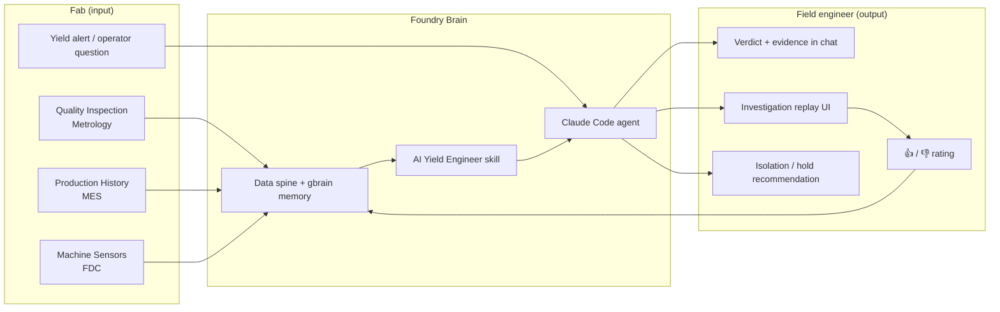
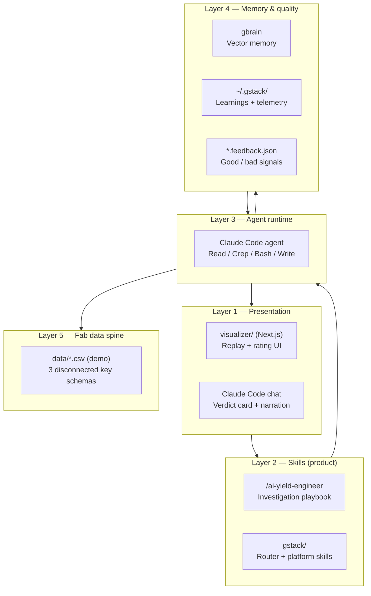
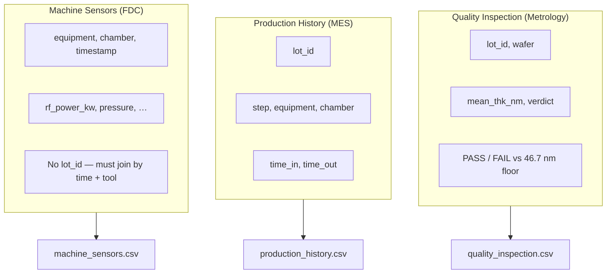
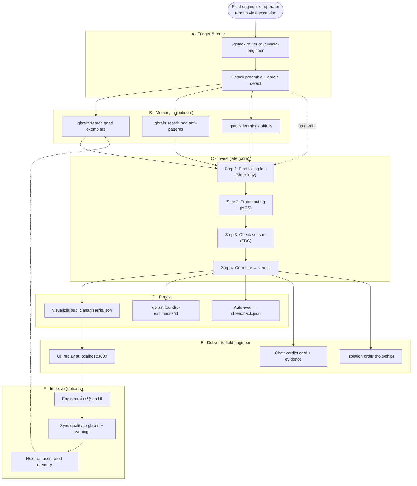
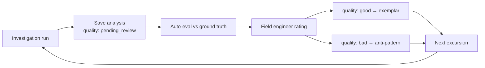

# Foundry Brain — Application Architecture & Pipeline

**Foundry Brain** — Company Brain, built for the fab.

This document describes the end-to-end system: fab data in → AI investigation → deliverables to the **field engineer** (yield engineer on the floor), including memory and feedback for self-improvement.

---

## 1. System context (who touches what)



| Actor | Role |
| --- | --- |
| **Fab systems** | Produce inspection, routing, and sensor data (today: mock CSVs; production: MES/FDC/Metrology APIs or exports) |
| **Foundry Brain** | Orchestrates investigation procedure, memory, and persistence |
| **Field engineer** | Asks the question, validates the analysis, acts on hold/ship, rates quality |

---

## 2. Architectural layers



| Layer | Repo path | Responsibility |
| --- | --- | --- |
| Presentation | `visualizer/` | Show investigation replay; capture engineer rating |
| Skills | `.claude/skills/ai-yield-engineer/` | Procedure, specs, persistence instructions |
| Platform | `.claude/skills/gstack/` | Routing, preamble, learnings, gbrain integration bins |
| Agent | Claude Code (host) | Executes skill; **is** the LLM — no separate inference API |
| Memory | gbrain + `foundry-excursions/*` | Cross-session case history |
| Data spine | `foundry-brain/data/` | Fab inputs (mock today) |

---

## 3. Fab input — three systems

The fab does **not** send one unified database. Foundry Brain accepts three streams with **different keys** — matching real fabs.



| System | Demo file | Production source (target) | Key |
| --- | --- | --- | --- |
| Quality Inspection | `quality_inspection.csv` | Metrology / inline inspection | `lot_id` |
| Production History | `production_history.csv` | MES / genealogy | `lot_id` |
| Machine Sensors | `machine_sensors.csv` | FDC / equipment historian | `equipment + time` |

**Trigger input (human):** natural-language alert, e.g. *“Yield dropped 12% — what caused it?”*

**Reference specs (in skill):** thickness target 48.2 nm, floor 46.7 nm; RF center 2.10 kW, alarm 2.40 kW.

---

## 4. End-to-end pipeline



---

## 5. Output to the field engineer

Everything the yield engineer needs to **act** — not just analyze.

| Output | Channel | Content |
| --- | --- | --- |
| **Verdict card** | Claude Code chat | Root cause, evidence summary, affected lots, HOLD/ship |
| **Auditable steps** | Chat narration | Each system queried, what was found (trust) |
| **Investigation replay** | Visualizer (`/`) | Animated: Inspect → Trace → Sensors → Verdict |
| **Suspect board** | Visualizer | Equipment confidence narrowing |
| **RF drift chart** | Visualizer | Sub-alarm drift visualization |
| **Isolation order** | Visualizer + chat | Equipment hold, affected lots, suggested fix |
| **Quality rating** | Visualizer 👍/👎 | Engineer validates analysis for future runs |

### Verdict card format (chat)

```
ROOT CAUSE : Etch-3 / Chamber C   (RF drift, in-spec so no alarm)
EVIDENCE   : 5/5 failing lots, 10:00–12:00; RF 2.31 kW vs 2.10 kW center
AFFECTED   : LOT-0703, 0704, 0707, 0708, 0711
RECOMMEND  : HOLD affected lots — do not ship pending re-measure
```

### Structured artifacts (machine-readable)

| File | Schema | Use |
| --- | --- | --- |
| `visualizer/public/analyses/<id>.json` | `Analysis` in `visualizer/src/lib/analysis.ts` | UI replay (gitignored runtime output) |
| `foundry-brain/fixtures/analyses/` | Committed demo seed | `npm run seed-analyses` |
| `visualizer/public/analyses/index.json` | `AnalysisSummary[]` | History selector (gitignored) |
| `visualizer/public/analyses/<id>.feedback.json` | `AnalysisFeedback` | Good/bad + auto-eval (gitignored) |
| gbrain `foundry-excursions/<id>` | Markdown + frontmatter | Next-run retrieval |

---

## 6. Component map (repository)

```
foundry-brain/
├── CLAUDE.md
├── .claude/skills/
│   ├── gstack/                        # GStack platform
│   ├── foundry-brain/                 # Shared brain — data + memory bins
│   │   ├── SKILL.md
│   │   ├── data/                      # MES / FDC / Metrology CSVs
│   │   ├── fixtures/analyses/         # Committed demo seed
│   │   └── bin/                       # gbrain save, eval, feedback sync
│   ├── ai-yield-engineer/             # Skill #1
│   ├── hold-or-ship/                  # Future stub
│   ├── drift-watch/                   # Future stub
│   ├── commonality/                   # Future stub
│   └── excursion-diagnosis/           # Deprecated redirect
├── visualizer/                        # Field engineer UI
│   ├── src/app/page.tsx               # Replay orchestration
│   ├── src/components/VerdictCard.tsx # Verdict + 👍/👎
│   └── src/app/api/feedback/          # Rating → feedback.json + gbrain
└── library/                           # Reference clones (gstack, gbrain)
```

---

## 7. Self-improvement loop



| Signal | Source | Effect |
| --- | --- | --- |
| Auto-eval | `foundry-eval-analysis.py` | Etch-3/C, 5 lots, HOLD — instant draft rating |
| Human 👍 | VerdictCard → `/api/feedback` | Promotes run as exemplar in gbrain |
| Human 👎 | Same | Anti-pattern + `learnings.jsonl` pitfall |
| Unrated | Default | Not used as exemplar |

---

## 8. Demo vs production (today)

| Aspect | Demo (now) | Production (target) |
| --- | --- | --- |
| Fab data | 3 CSV mocks in skill `data/` | Live MES / FDC / Metrology feeds or APIs |
| Trigger | Engineer in Claude Code | MES alert, email, or fab dashboard webhook |
| Agent host | Claude Code on engineer laptop | On-prem or VPC agent; data stays in fab |
| Memory | gbrain PGLite or Supabase (`/setup-gbrain`) | Fab-hosted brain; no outbound data |
| UI | `localhost:3000` visualizer | Internal fab URL; SSO |
| Ground truth | Planted Etch-3/C scenario | Engineer sign-off; optional known golden cases |

---

## 9. Design principles

1. **Procedure over model** — Expertise in `SKILL.md`, not fine-tuning.
2. **Show the work** — Field engineer sees reasoning path, not a black-box score.
3. **Three-system reality** — Architecture assumes disconnected keys; no fantasy unified DB.
4. **Act, not just analyze** — Output includes hold/ship and isolation order.
5. **Memory with quality gates** — Only rated-good runs become exemplars.
6. **Platform growth** — Same data spine supports future skills (Drift Watch, Hold-or-Ship, Commonality).

---

## 10. Quick reference — one excursion

| Phase | Input | Output |
| --- | --- | --- |
| Trigger | “Yield dropped 12%” | Skill invoked |
| Memory | Prior gbrain pages | Hypothesis hints |
| Investigate | 3 CSV systems | Root cause + evidence |
| Persist | Analysis JSON + gbrain | Replay + memory |
| Deliver | — | Chat verdict + UI + hold order |
| Validate | Auto + 👍/👎 | Tagged memory for next run |
